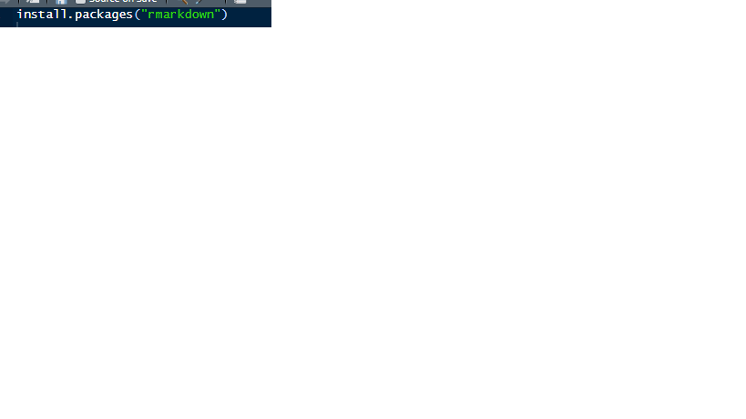
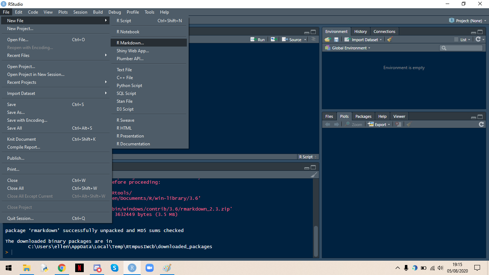
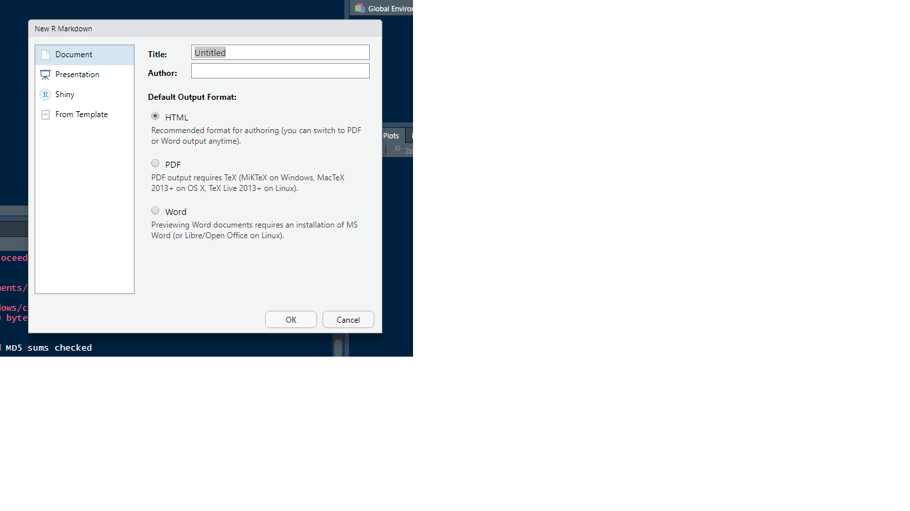

# Introdção {#intro}
Neste curso, iremos aprender a utilizar o R Markdown para gerar documentos.
## O que é 
Markdown é uma linguagem de marcação usada para formatar de maneira simples os textos redigidos e converte-los em HTML. John Gruber e Aaron Swartz, os criadores desse sistema, utilizaram marcadores como: #, \* ,! , [] e (). Assim é possível inserir em nossos textos: títulos, listas, formatação de fonte, imagens e tabelas.
R Markdown é um documento criado no R Studio (Ou em outras IDEs) que possibilita empregar os recursos da linguagem markdown citados acima em conjunto com a linguagem R, permitindo a melhor organização de análises, relatórios e códigos em um só documento.


## Possíveis tipos de Outputs
O R Markdown apresenta várias possibilidades de outputs (renderizar) nos formatos de documentos, apresentações, entre outros, sendo que em cada formato há várias opções de customização. Vejamos abaixo os principais: 
Documentos
 -html_document – documento no formato HTML;
 -pdf_document – documento no formato PDF (via o modelo LaTeX);
 -word_document – documento no formato do editor de texto Microsoft Word (docx);
 -odt_documento – documento no formato dos editores de texto Libre Office e OpenDocument;
 -rtf_documento – documento no formato Rich Text Format (rtf).

Apresentações (slides)
       -ioslides_presentation – apresentação no formato HTML com ioslides;
       -beamer_presentation – apresentação no formato PDF com LaTeX Beamer;
       -powerpoint_presentation – apresentação no formato power point.

Outros
        -flexdashboard::flex_dashboard – apresentação interativa com dashboards;
        -htm_vignette – R package vignette no format HTML
        -github_document – document no format GitHub

Você pode escolher o output desejado quando for criar um documento conforme a figura 1.  Para fazer deve-se clicar em file > new file > R Markdown. Abrirá uma aba e nela há quatro formas de output previamente estabelecidas, a saber: Document (HTML, PDF e Word), Presentation (HTML (ioslides), HTML (slidy), PDF (Beamer) e PowerPoint), Shiny (Shiny Document e Shy Presentation) e From Template (GitHub document e Package Vignette).  Escolha uma e clique em OK. 
Além disso, você também pode alterar o formato utilizando a função abaixo, sendo que render refere-se ao local que está salvo seu documento e output_format ao tipo de documento desejado, conforme os exemplos apontados no início. 

`render("teste.Rmd", output_format = "pdf_document")`

O mesmo pode ser feito para outros formatos. 

`r knitr::combine_words(grep('^[^_]+_(document|presentation)$', ls(asNamespace('rmarkdown')), value = TRUE), sep = '\n', and = '', before = '- \x60', after = '\x60')`

## Download (rmd e latex)

### Windows

### Linux

### MacOS

## Criando o primeiro documento
Para gerar um arquivo em R Markdown é necessário abrir o programa R Studio, e instalar o pacote rmarkdown :

Após a instalação do pacote no R Studio, siga os seguintes passos:

- Em seguida, escolha o tipo de arquivo desejado:

Obs: Para gerar documentos em PDF, é necessário ter instalado em seu computador o programa [Latex](https://miktex.org/)

Seguindo os passos acima, você terá criado o seu primeiro documento em R Markdown.

Vale ressaltar que é possível utilizar o R Markdown sem que tenha instalado o R Studio, porém, é necessário ter instalado o programa [Pandoc](https://pandoc.org)


````

```{r}
print(2)
```


````

