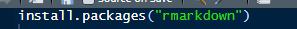
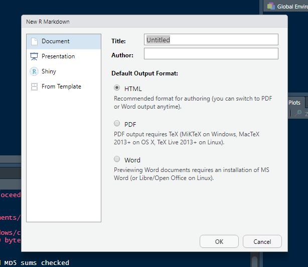

# Introdução {#intro}
A fim de aprimorar os membros, e passar a utilizar o software para fins internos, este curso tem como propósito ensinar R Markdown para gerar documentos.

## O que é 
Markdown é uma linguagem de marcação usada para formatar de maneira simples os textos redigidos e converte-los em HTML. John Gruber e Aaron Swartz, os criadores desse sistema, utilizaram marcadores (#, \*, !, (), [])  para inserir nos textos, elementos como: títulos, listas, formatação de fonte, imagens e tabelas.

Com base nisso, R markdown é uma extensão da linguagem markdown que pode ser usado em IDEs como o R Studio possibilitando assim empregar os recursos da linguagem markdown citados acima em conjunto com a linguagem R, permitindo a melhor organização de análises, relatórios e códigos em um só documento.


## Possíveis tipos de Outputs
O R Markdown apresenta várias possibilidades de outputs (tipos de renderização), tais como nos formatos de documentos, apresentações, entre outros, sendo que em cada formato há várias opções de customização. A seguir estão os principais formatos:

**Documentos:**

- html_document – documento no formato HTML;
- pdf_document – documento no formato PDF (via o modelo LaTeX);
- word_document – documento no formato do editor de texto Microsoft Word (docx);
- odt_document – documento no formato dos editores de texto Libre Office e OpenDocument;
- rtf_document – documento no formato Rich Text Format (rtf).

**Apresentações (slides):**

- ioslides_presentation – apresentação no formato HTML com ioslides;
- beamer_presentation – apresentação no formato PDF com LaTeX Beamer;
- powerpoint_presentation – apresentação no formato power point.

**Outros:**

- flexdashboard::flex_dashboard – apresentação interativa com dashboards;
- htm_vignette – R package vignette no format HTML
- github_document – document no format GitHub

Pode-se escolher o output desejado quando for criar um documento conforme a figura 1.  Para fazê-lo, deve-se clicar em `file > new file > R Markdown`. Será aberta uma aba com quatro opções de output previamente estabelecidas, sendo elas:
1) Document (HTML, PDF e Word);
2) Presentation (HTML (ioslides);
3)HTML (slidy);
4) PDF (Beamer);
5) PowerPoint;
6) Shiny (Shiny Document e Shy Presentation)
7) From Template (GitHub document e Package Vignette)

Além disso, pode-se alterar o formato utilizando a função abaixo, sendo que `render` refere-se ao local que está salvo seu documento e `output_format` ao tipo de documento desejado, conforme os exemplos apontados no início. 

```{r, eval = FALSE}
render("teste.Rmd", output_format = "pdf_document")
```

O mesmo pode ser feito para outros formatos. 
Abaixo está uma lista com todos os formatos suportados por padrão com o pacote `rmarkdown`.

`r knitr::combine_words(grep('^[^_]+_(document|presentation)$', ls(asNamespace('rmarkdown')), value = TRUE), sep = '\n', and = '', before = '- \x60', after = '\x60')`

## Criando o primeiro documento
Para gerar um arquivo em R Markdown é necessário abrir o programa R Studio e instalar o pacote rmarkdown :
<!---->
```{r, eval = FALSE}
install.packages("rmarkdown")
```

Após a instalação do pacote no R Studio, siga os seguintes passos:


Em seguida, escolha o tipo de arquivo desejado:



*Obs*: Para gerar documentos em PDF, é necessário ter instalado em seu computador o programa [Latex](#download-miktex).

Seguindo os passos acima, você terá criado o seu primeiro documento em R Markdown. Vale ressaltar que é possível utilizar o R Markdown sem que tenha instalado o R Studio, porém, é necessário ter instalado o programa [Pandoc](https://pandoc.org).

## Download MiKTeX
Para exportar um arquivo PDF utilizando o R Markdown é necessário um motor LaTex pois é ele que irá converter o arquivo .tex em PDF.

É necessário que o programa MiKTeX esteja instalado no computador (download disponível em https://miktex.org/download).

### Windows
Selecione a aba *Windows* e clique no botão de download.


### Linux
Selecione a aba *Linux* em seguida a aba de sua distribuição Linux para receber as instruções de instalação.


### MacOS
Selecione a aba *MacOS* e clique no botão de download.


#### Configuração do MikTeX para Windows

Após ter instalado o MikTeX, deve-se atualizá-lo. Para isso, ao abrir o MikTeX console seleciona-se a opção *chek for updates*. 

```{r, echo=FALSE, out.width = '100%'}

```


Quando o MikTeX checar as atualizações, deve-se prosseguir para a aba *update* e selecionar *update now.* 

```{r, echo=FALSE, out.width = '100%'}

```

Por fim, na aba *settings*, deve-se alterar em *You can chose whether missing packages are to be installed on-the-fly*  a opção *Ask me para Always install missing packages on-the-fly*. 

```{r, echo=FALSE, out.width = '100%'}

```
