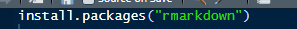
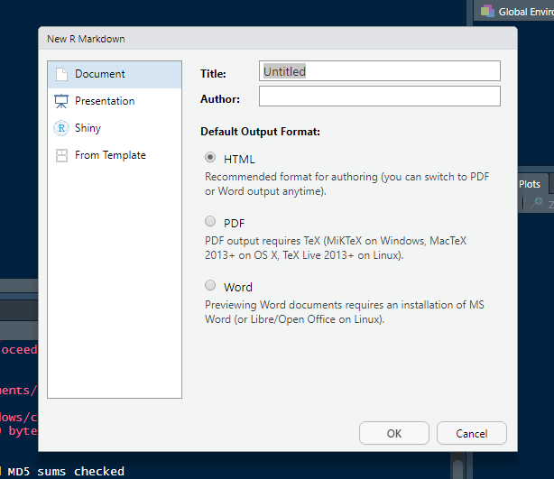
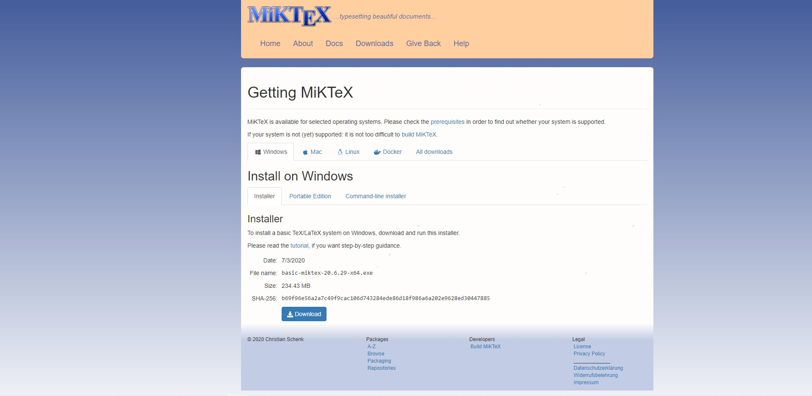
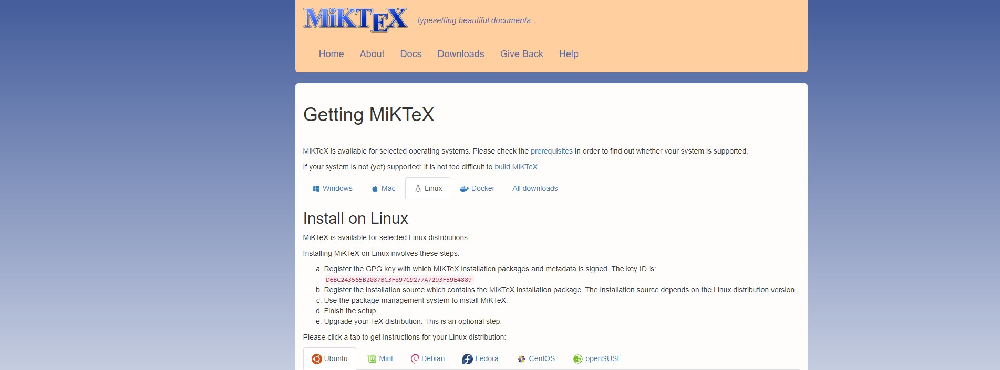
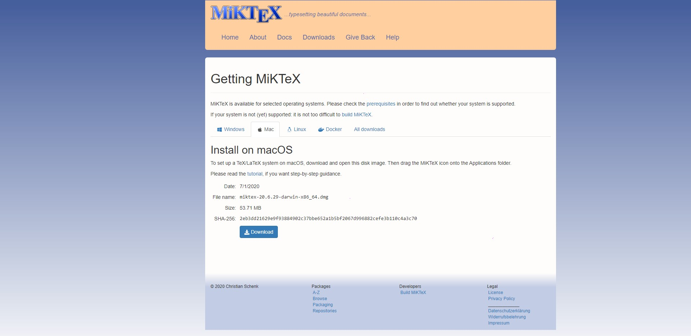
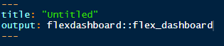
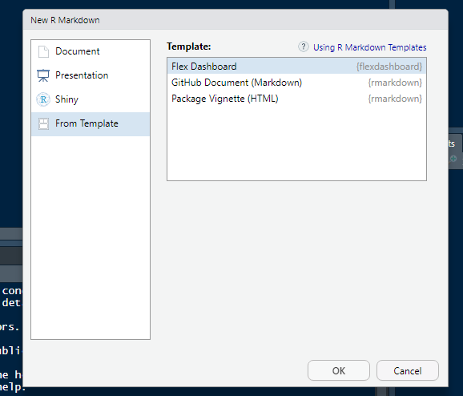

--- 
title: "Introdução ao R Markdown"
author: "Eduardo José de Campos Lemos Júnior, Samuel Vianna Quintanilha"
date: "`r Sys.Date()`"
output: pdf_document
description: Curso de R Markdown...
documentclass: book
link-citations: yes
site: bookdown::bookdown_site
biblio-style: apalike
github-repo: estatsej/curso_rmarkdown
---

<!--chapter:end:00-index.Rmd-->

# Introdução {#intro}
Neste curso, iremos aprender a utilizar o R Markdown para gerar documentos.

## O que é 
Markdown é uma linguagem de marcação usada para formatar de maneira simples os textos redigidos e converte-los em HTML. John Gruber e Aaron Swartz, os criadores desse sistema, utilizaram marcadores como: `#, \* ,! , [] e ()`. Assim é possível inserir em nossos textos: títulos, listas, formatação de fonte, imagens e tabelas.
R Markdown é um documento criado no R Studio (Ou em outras IDEs) que possibilita empregar os recursos da linguagem markdown citados acima em conjunto com a linguagem R, permitindo a melhor organização de análises, relatórios e códigos em um só documento.


## Possíveis tipos de Outputs
O R Markdown apresenta várias possibilidades de outputs (renderizar) nos formatos de documentos, apresentações, entre outros, sendo que em cada formato há várias opções de customização. Vejamos abaixo os principais: 

Documentos:

- html_document – documento no formato HTML;
- pdf_document – documento no formato PDF (via o modelo LaTeX);
- word_document – documento no formato do editor de texto Microsoft Word (docx);
- odt_documento – documento no formato dos editores de texto Libre Office e OpenDocument;
- rtf_documento – documento no formato Rich Text Format (rtf).

Apresentações (slides):

- ioslides_presentation – apresentação no formato HTML com ioslides;
- beamer_presentation – apresentação no formato PDF com LaTeX Beamer;
- powerpoint_presentation – apresentação no formato power point.

Outros:

- flexdashboard::flex_dashboard – apresentação interativa com dashboards;
- htm_vignette – R package vignette no format HTML
- github_document – document no format GitHub

Você pode escolher o output desejado quando for criar um documento conforme a figura 1.  Para fazer deve-se clicar em `file > new file > R Markdown`. Abrirá uma aba e nela há quatro formas de output previamente estabelecidas, a saber: Document (HTML, PDF e Word), Presentation (HTML (ioslides), HTML (slidy), PDF (Beamer) e PowerPoint), Shiny (Shiny Document e Shy Presentation) e From Template (GitHub document e Package Vignette).  Escolha uma e clique em OK. 
Além disso, você também pode alterar o formato utilizando a função abaixo, sendo que render refere-se ao local que está salvo seu documento e output_format ao tipo de documento desejado, conforme os exemplos apontados no início. 

```{r, eval = FALSE}
render("teste.Rmd", output_format = "pdf_document")
```

O mesmo pode ser feito para outros formatos. 
Abaixo está presente uma lista com todos os formatos suportados por padrão com o pacote `rmarkdown`.

`r knitr::combine_words(grep('^[^_]+_(document|presentation)$', ls(asNamespace('rmarkdown')), value = TRUE), sep = '\n', and = '', before = '- \x60', after = '\x60')`

## Criando o primeiro documento
Para gerar um arquivo em R Markdown é necessário abrir o programa R Studio, e instalar o pacote rmarkdown :
<!---->
```{r, eval = FALSE}
install.packages("rmarkdown")
```

Após a instalação do pacote no R Studio, siga os seguintes passos:


Em seguida, escolha o tipo de arquivo desejado:


Obs: Para gerar documentos em PDF, é necessário ter instalado em seu computador o programa [Latex](#download-rmd-e-latex)

Seguindo os passos acima, você terá criado o seu primeiro documento em R Markdown.

Vale ressaltar que é possível utilizar o R Markdown sem que tenha instalado o R Studio, porém, é necessário ter instalado o programa [Pandoc](https://pandoc.org)

## Download MiKTeX
Para exportar um arquivo PDF utilizando o R Markdown é necessário um motor LaTex pois é ele que irá converter o arquivo .tex em PDF.
Então é necessário que tenha instalado em seu computador o programa MiKTeX,. Para fazer o download é só acessar o link: https://miktex.org/download.

### Windows
Selecione a aba Windows e clique no botão de download:


### Linux
Selecione a aba Linux em seguida a aba de sua distribuição Linux para receber as instruções de instalação:


### MacOS
Selecione a aba macOS e clique no botão de download:


<!--chapter:end:01-introducao.Rmd-->

---
output:
  word_document: default
  html_document: default
  pdf_document: default
---
# Sintaxe

## Prêambulo

No início de um documento R Markdown, é utilizada a linguagem [yaml](https://pt.wikipedia.org/wiki/YAML) para definir as configurações do seu arquivo.
As configurações disponiveis no preâmbulo do seu documento R Markdown são variadas, podendo inclusive ter diferentes opções para diferentes tipos de arquivos.
Uma das configurações mais importantes para se definir no seu preambulo é o [tipo de documento](#possíveis-tipos-de-outputs) a ser gerado.

### Definindo tipo de output

A opçao de [tipo de documento](#possíveis-tipos-de-outputs) é definida da seguinte forma:

```
---
output: pdf_document
---
```

No código acima, `output` foi definido como `pdf_document()`. Output é o formato final do seu documento, e `pdf_document()` é, dentro do pacote `rmarkdown`, o formato pdf. Para gerar arquivos de formatos diferentes, é necessário somente que seja modificado a opção de `output` no preâmbulo.
Note que a opção definida no preâmbulo foi escrita entre duas linhas tracejadas, não é possível definir suas configurações fora dessas linhas tracejadas, da mesma forma, não é possível escrever partes do seu documento ou rodar códigos de `R` dentro das linhas.
Por padrão no `yaml` utilizado no preâmbulo de R Markdown, a opção a ser definida é escrita sem espaços, seguida de dois pontos, espaço e então a definição da opção.
Existem opções dentro de outras opções, como por exemplo `pdf_document()`, podemos definir configurações se o documento terá ou não sumário, quantos níveis de [cabeçalho](#cabeçalhos) serão utilizados no sumário, etc.

```
---
output: pdf_document:
  toc: true
  toc_depth: 3
  latex_engine: xelatex
---
```

No exemplo acima, definimos `toc` (table of contents) como `true`, o que vai fazer com que seja gerado um sumário no documento final, perceba que em `yaml` o valor lógico de verdadeiro é escrito com todas as letras minúsculas. Definindo `toc_depth` como `3`, quando o sumário for gerado, até três níveis de [cabeçalho](#cabeçalhos) apareceram no sumário.

### Informações Gerais

Além do tipo de documento, e das opções de cada tipo de documento, podemos definir algumas opções gerais, como autor, título do documento, e data.

```
---
author: "Fulano"
output: pdf_document:
  toc: true
  toc_depth: 3
  latex_engine: xelatex
---
```

Seguindo com o preâmbulo já feito anteriormente, foi adicionada a opção `author`, que irá definir o autor do seu documento. Por padrão, o autor irá aparecer na página inicial de diversos [tipos de documento](#possíveis-tipos-de-outputs).

```
---
date: 1 de janeiro de 1970
output: pdf_document:
  toc: true
  toc_depth: 3
  latex_engine: xelatex
author: Fulano
---
```

Utilizando a opção `date` podemos definir uma data para o documento, semelhante ao autor, a data aparece por padrão no início dos documentos.
Perceba que no exemplo acima, o nome do autor e a data foram escritas sem aspas, mas irão funcionar da mesma forma, perceba também que a opção do autor foi trocada de ordem, as opções do preâmbulo não necessitam de uma ordem específica, mas as opções de dentro de outras opções devem sempre estar abaixo da opção mae (sei la como chamar isso) e com uma identação a mais.

```
---
author: Fulano
date: 1 de janeiro de 1970
title: Título
output: pdf_document:
  toc: true
  toc_depth: 3
  latex_engine: xelatex
---
```

Por fim foi definida também a opção `title` que irá definir o título do documento final. Para maior customização do seu documento pelo preâmbulo veja o [capítulo 4](#depois-crio).

### Sumario

## Textos


### Títulos

```
# Título Nível 1

## Título Nível 2

### Título Nível 3

#### Título Nível 4

##### Título Nível 5

###### Título Nível 6
```


### Formatação de textos (negrito, itálico, sobrescrito, tachado e código)

```
*Negrito* _Negrito_
```

**Negrito** __Negrito__

```
**Italico** __italico__
```

*Italico* _Italico_

```
texto^sobrescrito^
```

texto^sobrescrito^

```
~~~tachado~~

````
~~~tachado~~

### Links

Para um link devemos utilizar a seguinte sintaxe:
```
[nome do link](url do link)
[Curso de RMarkdown](https://estatsej.github.io/curso_rmarkdown)
```
Existem também outras variações para que utlizemos os links em nosso material.

__1 - Nome do link seja ele próprio__:

https://estatsej.github.io/curso_rmarkdown

__2- Link contendo um título, que aparece ao deixar o cursor do mouse em cima do link:__

```
[Curso de RMakrdown](https://estatsej.github.io/curso_rmarkdown "Aqui está o nosso curso de RMarkdown")
```
Podemos observar:
[Curso de RMakrdown](https://estatsej.github.io/curso_rmarkdown "Aqui está o nosso curso de RMarkdown")


### Listas

__Lista Ordenada__

```
1. Primeiro item
2. Segundo item
3. Terceiro item
```

__Lista Não-Ordenada__
```
- Primeiro item
- Segundo item
- Terceiro item
```

__Lista com Sublista__
```
1. Item
    - Um sub-item
    - Outro sub-item
```

## Inserindo Imagens

Antes de inserir a imagem escolhida podemos definir a configuração global para todas as imagens, lembrando que a configuração feita diretamente na imagem vai sobrepor a configuração global.

````markdown
`r ''````{r setup, include=FALSE}
library(knitr)
opts_chunk$set(echo = FALSE,
               out.width = "10%", 
               fig.align = "center")
```
````

Se um gráfico ou imagem não for gerado a partir de um código feito por R, você poderá incluí-lo de duas maneiras:

- Usando a sintaxe Markdown ``````. Nesse caso, você pode definir o tamanho da imagem usando os atributos ```width``` ou ```height```, por exemplo:

```
{width=50%}
```

- Usando a função ```knitr::include_graphics(```) em qualquer parte do código. Você pode usar opções de configuração de tamanho como ```out.width``` ou ```out.height``` para esse exemplo:

````markdown
`r ''````{r, echo=FALSE, out.width="50%", fig.cap="Logo da Estats"}
knitr::include_graphics("img/logoestats.jpeg")
```
````
Se você souber que deseja gerar a imagem apenas para um formato de saída específico, poderá usar uma unidade específica. Por exemplo, você pode usar ```out.width="300px"``` se o formato de saída for HTML, mas no nosso exemplo o formato que usamos ```out.width="50%"``` é válido para qualquer saída.

E podemos aliar as imagens utilizando ```fig.align```. Por exemplo, você pode centralizar imagens ```fig.align="center"``` ou alinhar à direita as imagens ```fig.align="right'"```. Está opção funciona para saída HTML e LaTeX, mas pode não funcionar para outros formatos de saída (como o Word).

No código a seguir é utilizado quando o seu projeto tem múltiplas saídas (PDF,HTML,...) e ocorra problema na inclusão das imagens, então a sugestão para o melhor caminho foi fazer a validação para obter a saída utilizada, sabendo disso podemos fazer configuração e inserindo imagens especifica para cada saída.

````markdown
`r ''````{r, fig.cap="Logo da Estats"}
if (knitr::is_html_output()) {
    knitr::include_graphics("img/logoestats.jpeg")
} else {
    knitr::include_graphics("img/logoestats.jpeg")
}
```
````
```{r, fig.cap="Logo da Estats", fig.align = "center"}
if (knitr::is_html_output()) {
    knitr::include_graphics("img/logoestats.jpeg")
} else {
    knitr::include_graphics("img/logoestats.jpeg")
}
```

Os dois exemplos abaixo são casos de curiosidades:

- Nesse caso podemos utilizar vetor para colocar várias imagem juntas.

````markdown
`r ''````{r image}
include_graphics(c("img1.jpeg", "img2.jpeg"))
```
````

- E nesse último caso podemos fazer repetição de uma imagem várias vezes.

````markdown
`r ''````{r}
knitr::include_graphics(rep("img/logoestats.jpeg", 3))
```
````

```{r}
knitr::include_graphics(rep("img/logoestats.jpeg", 3))
```

## Exemplos

[Exemplo Sumário e Cabeçalhos](exemplos/102-sumario_e_cabecalho.html)

[Exemplo formatação de textos](exemplos/103-formatacao_de_texto.html)

<!--chapter:end:02-sintaxe.Rmd-->

# Executando Código

## Introdução

## Flags

There are a large number of chunk options\index{chunk options} in **knitr** documented at https://yihui.name/knitr/options. We list a subset of them below:

- `eval`: Whether to evaluate a code chunk.

- `echo`: Whether to echo the source code in the output document (someone may not prefer reading your smart source code but only results).

- `results`: When set to `'hide'`, text output will be hidden; when set to `'asis'`, text output is written "as-is", e.g., you can write out raw Markdown text from R code (like `cat('**Markdown** is cool.\n')`). By default, text output will be wrapped in verbatim elements (typically plain code blocks).

- `collapse`: Whether to merge text output and source code into a single code block in the output. This is mostly cosmetic: `collapse = TRUE` makes the output more compact, since the R source code and its text output are displayed in a single output block. The default `collapse = FALSE` means R expressions and their text output are separated into different blocks.

- `warning`, `message`, and `error`: Whether to show warnings, messages, and errors in the output document. Note that if you set `error = FALSE`, `rmarkdown::render()` will halt on error in a code chunk, and the error will be displayed in the R console. Similarly, when `warning = FALSE` or `message = FALSE`, these messages will be shown in the R console.

- `include`: Whether to include anything from a code chunk in the output document. When `include = FALSE`, this whole code chunk is excluded in the output, but note that it will still be evaluated if `eval = TRUE`. When you are trying to set `echo = FALSE`, `results = 'hide'`, `warning = FALSE`, and `message = FALSE`, chances are you simply mean a single option `include = FALSE` instead of suppressing different types of text output individually.

- `cache`: Whether to enable caching. If caching is enabled, the same code chunk will not be evaluated the next time the document is compiled (if the code chunk was not modified), which can save you time. However, I want to honestly remind you of the two hard problems in computer science (via Phil Karlton): naming things, and cache invalidation. Caching can be handy but also tricky sometimes.

- `fig.width` and `fig.height`: The (graphical device) size of R plots in inches. R plots in code chunks are first recorded via a graphical device in **knitr**, and then written out to files. You can also specify the two options together in a single chunk option `fig.dim`, e.g., `fig.dim = c(6, 4)` means `fig.width = 6` and `fig.height = 4`.

- `out.width` and `out.height`: The output size of R plots in the output document. These options may scale images. You can use percentages, e.g., `out.width = '80%'` means 80% of the page width.

- `fig.align`: The alignment of plots. It can be `'left'`, `'center'`, or `'right'`.

- `dev`: The graphical device to record R plots. Typically it is `'pdf'` for LaTeX output, and `'png'` for HTML output, but you can certainly use other devices, such as `'svg'` or `'jpeg'`.

- `fig.cap`: The figure caption.

- `child`: You can include a child document in the main document. This option takes a path to an external file.

## Linguagens Suportadas

Por meio do pacote knitr que forneceu um grande número de motores de linguagem o R Markdown suporta outras linguagens tais como [Python](https://www.python.org/), [Julia](https://julialang.org/), C++, SQL. Esses motores de linguagem podem ser acessados dentro de blocos de código designando sua respectiva engine, as engines no knitr são:

```{r}
names(knitr::knit_engines$get())
```

### Linguagem Python

Para utilizar a linguagem python primeiro é necessário instalar o pacote reticulate com o comando:
```{r, eval = FALSE}
install.packages("reticulate")
```

Com esse pacote é possível executar todos os fragmentos de código Python em uma mesma seção. Caso deseje executar um trecho do código pode usar o comando:

`python.reticulate = FALSE`

Vale ressaltar que se você estiver usando uma versão do knitr inferior a 1.18 você deve atualizar seus pacotes R. Por padrão o reticulate usa a versão padrão encontrada em seu path. Para encontrar onde esta instalado o python em seu computador use o comando:

```{r, eval = FALSE}
Sys.which("python")
```

Você pode escolher a versão de Python com o comando:

```{r, eval = FALSE}
use_python()
```

Vejamos no exemplo 1 como você pode fazer:

Exemplo 1:

```{r, eval = FALSE}
library(reticulate)
use_python("/usr/local/bin/python")
```

Vejamos no exemplo 2 para usar pedaços de código Python. Outrossim, para isso você deve utilizar o comando

```{r, eval = FALSE}
py$name 
```

Onde `name` é o nome da variável que você deseja usar na sessão Python. Para recuperar um valor Python use também py$name. 

Exemplo 2:

Um pedaço de código R normal

```{r}
x <- 42
print(x)
```

No exemplo 3 vemos a utilização de um pedaço de um código python 

Exemplo 3:

```{python teste}
x = 42 * 2
print(x)
```

O valor de `x` na sessão Python é py$x. Não é o mesmo `x` de R.

### Script Shell

Você pode escrever scripts Shell em R Markdown, se seu sistema puder executá-los (o bash executável ou sh deve existir). Normalmente, isso não é um problema para usuários de Linux ou macOS. Não é impossível para os usuários do Windows, mas você terá que instalar software adicional (como Cygwin ou o Subsistema Linux).

### SQL

Como o mecanismo SQL usa o pacote DBI você deve estabelecer uma conexão DBI com um banco de dados. Você pode utilizar o comando 

```{r, eval = FALSE}
DBI::dbConnect()
```

Você pode usar essa conexão em um fragmento SQL através da opção de conexão como mosta o exemplo 4 utilizando SQLite.

Exemplo 4:

```{r, eval = FALSE}
library(DBI)
db = dbConnect(RSQLite::SQLite(), dbname = "sql.sqlite")
```

Onde `sql.sqlite` é o nome do arquivo sqlite.

````markdown
`r ''` ```{sql, connection = db}
SELECT * FROM trials
```
````

O número de registros exibidos é controlado pela opção `max.print` que é derivada da função sql.max.print.

No exemplo 5 o seguinte fragmento de código exibe os 15 primeiros registros.

````markdown
`r ''` ```{sql, connection=db, max.print = 15}
SELECT * FROM trials
```
````

Caso queria especificar para nenhum limite no registro utilize `max.print = NA`.

Se você quiser atribuir os resultados da consulta SQL a um objeto R como um quadro de dados basta utilizar o comando `output.var`.

Como mostra o exemplo 6

````markdown
`r ''` ```{sql, connection=db, output.var="trials"}
SELECT * FROM trials
```
````

Quando os resultados de uma consulta SQL são atribuídos a um quadro de dados, nenhum registro será impresso no documento. Caso queira, você pode imprimir manualmente o quadro de dados em um bloco R subsequente. Se você precisar ligar os valores das variáveis R em consultas SQL, você pode fazer isso prefaciando a variável R referências com uma interrogação (?). Assim como mostra o exemplo 7.

```{r}
subjects = 10
```

````markdown
`r ''` ```{sql, connection=db, output.var="trials", eval = FALSE}
SELECT * FROM trials WHERE subjects >= ?subjects
```
````

Se você tiver muitos fragmentos SQL, pode ser útil definir um padrão para a opção de fragmento de conexão no fragmento de configuração, de forma que não seja necessário especificar a conexão em cada fragmento individual. Você consegue conforme mostra o exemplo 8.

```{r setup, eval = FALSE}
library(DBI)
db = dbConnect(RSQLite::SQLite(), dbname = "sql.sqlite")
knitr::opts_chunk$set(connection = "db")
```

Observe que a opção de conexão deve ser uma string nomeando o objeto de conexão (não o próprio objeto). Depois de definido, você pode executar blocos SQL sem especificar uma conexão explícita como mostra o exemplo 9.

````markdown
`r ''` ```{sql}
SELECT * FROM trials
```
````

### Rcpp

O mecanismo Rcpp permite a compilação de C ++ em funções R com o comando `rcpp::sourceCpp()`

O resultado é apresentado no exemplo 10.

````markdown
`r ''` ```{Rcpp}
#include <Rcpp.h>
using namespace Rcpp;
// [[Rcpp::export]]
NumericVector timesTwo(NumericVector x) {
return x * 2;
}
```
````

A execução desse trecho compilará o código e tornará a função C ++ com o comando:

timesTwo () 

Disponível para R. Você pode armazenar em cache a compilação de blocos de código C ++ usando o cache de knitr padrão, ou seja, adicionar o comando:

cache = TRUE

Conforme mostra o exemplo 11. 

````markdown
`r ''` ```{Rcpp, cache=TRUE}
#include <Rcpp.h>
using namespace Rcpp;
// [[Rcpp::export]]
NumericVector timesTwo(NumericVector x) {
return x * 2;
}
```
````

Em alguns casos, é desejável combinar todos os pedaços de código Rcpp em um documento em uma única unidade de compilação, pois economiza tempo. Para isso use o comando `ref.label` junto com o comando `knitr::all_rcpp_labels()`.

Pois assim é possível coletar todos os fragmentos do Rcpp conforme mostra o exemplo 12

## Todos os fragmentos de códigos C++ serão combinados em um único fragmento.
````markdown
`r ''` ```{Rcpp, ref.label=knitr::all_rcpp_labels(), include=FALSE}
```
````

Primeiro é necessário incluir o leitor `Rcpp.h`

```{Rcpp, eval=FALSE}
#include <Rcpp.h>
```

Depois você define a função

```{Rcpp, eval=FALSE}
// [[Rcpp::export]]
int timesTwo(int x) {
return x * 2;
}
```

Assim os dois fragmentos com código Rcpp serão compilados juntos no primeiro pedaço.

### Stan 

A linguagem Stan permite a incorporação da linguagem probabilística. Para tanto, utilize o comando:

output.var 

Como mostra o exemplo 13

```{stan, output.var="ex1", eval = FALSE}
parameters {
real y[2];
}
model {
y[1] ~ normal(0, 1);
y[2] ~ double_exponential(0, 2);
}
```
```{r, eval = FALSE}
library(rstan)
fit = sampling(ex1)
print(fit)
```

### Java Script

Se você visa que seu documento tenha saída HTML, é possível executar um Java Script nele usando esta linguagem denominada js.
O exemplo 14 apresenta como mudar a cor do título para vermelho.

```{js, echo=FALSE}
$('.title').css('color', 'red')
```
Da mesma forma, você pode incorporar regras CSS no documento de saída. Por exemplo, o seguinte fragmento de código transforma
texto dentro do corpo do documento vermelho:

```{css, echo=FALSE}
body {
color: red;
}
```

### Julia

A linguagem Julia é suportado pelo pacote JuliaCall igual a linguagem python. Vejamos o exemplo 15 abaixo

```{julia}
a = sqrt(2); # the semicolon inhibits printing
```

### C and Fortran

Para blocos de código que usam C ou Fortran, o knitr usa R CMD SHLIB para compilar o código e carregar o objeto (um arquivo * .so no Unix ou * .dll no Windows). Então você pode usar o comando

 .C () / .Fortran ()

 Para chamar as funções C / Fortran conforma mostra o exemplo 16.

```{c, test-c, results='hide'}
void square(double *x) {
*x = *x * *x;
}
```
Test the `square()` function:
```{r}
.C('square', 9)
.C('square', 123)
```


<!-- citacoes **bookdown** [@R-bookdown] -->
<!-- Só pra ficar claro se alguem ler essa parte aqui, esse negócio esquisito é um comentário -->

## Exemplo
Para que o código seja executado no meio de um texto, é necessário usar o caractere `` ` ``, antes e depois do código descrito. Exemplo:

```{r, eval = FALSE, echo = TRUE}
Este texto gera: `r format(Sys.Date(), "%d/%m/%Y")`.
```

Este texto gera: `r format(Sys.Date(), "%d/%m/%Y")`.

***

O código também pode ser executado dentro de blocos. Blocos de código são inseridos da seguinte forma:
````markdown
`r ''````{r}
format(Sys.Date(), "%d/%m/%Y")
```
````

O que gera o seguinte output ao ser compilado seu arquivo R Markdown:

```{r}
format(Sys.Date(), "%d/%m/%Y")
```

***

Algumas das opções básicas de blocos de código [já mencionadas](#flags):
````markdown
`r ''````{r, echo = FALSE}
2 + 2
```
````

```{r, echo = FALSE}
2 + 2
```

````markdown
`r ''````{r, eval = FALSE}
2 + 2
```
````

```{r, eval = FALSE}
2 + 2
```

***

Exemplo de utilização de blocos de código para inserir imagens como descrito no [capítulo 2](#inserindo-imagens)

````markdown
`r ''````{r}
knitr::include_graphics("img/logoestats.jpeg")
```
````

```{r}
knitr::include_graphics("img/logoestats.jpeg")
```

***

Inserindo tabelas dentro de blocos de código:
````markdown
`r ''````{r}
knitr::kable(cars[1:5,], caption = "Carros")
```
````

```{r}
knitr::kable(cars[1:5,], caption = "Carros")
```

***

Exemplo utilizando outra [linguagem suportada](#linguagens-suportadas), neste caso python:
````markdown
`r ''````{python}
print(5 ** 3)
```
````

```{python}
print(5 ** 3)
```

***

Exemplos mais detalhados de R e de outras linguagens suportadas estão disponíveis neste [link](exemplos/104-intro_blocos_de_codigo.html).

<!--chapter:end:03-executando_codigo.Rmd-->

# Customização e Tipos de Arquivo

## Opções avançadas no preâmbulo


## Apresentação de slides
### ioslides
Para criar uma apresentação ioslides de R Markdown, você especifica `ioslides_presentation` no output nos metadados YAML do seu documento. Você pode criar uma apresentação de slides dividida em seções usando as tags de cabeçalho `#` e `##` (você também pode criar um novo slide sem cabeçalho usando uma régua horizontal (`---`). Por exemplo, aqui está uma apresentação de slides simples:

```
---
title: "Curso de R Makrdown"
author: Departamento de Estatística
date: 12 de Agosto de 2020
output: ioslides_presentation
---

# Capítulo 1

## O que é?

- R
- RMarkdown

## Capítulo 2

- R
  - RMarkdown

```

Você também pode adicionar um subtítulo ou seção incluíndo o texto após o caractere da barra vertifical (`|`). Por exemplo:

```
## Isto é um texto | Exemplo de subtítulo ou seção
```

### Modos de Exibição do Slide

Veja a seguir um conjunto de atalhos no teclado que permitem modos de exibição alternativos:
- `f`: habilita o modo de tela cheia
- `w`: habilita o modo janela
- `o`: habilita o modo de visão geral
- `h`: habilita o modo de highlight do código
- `p`: exibe as anotações presentes

Pressione a tecla `Esc` para sair dos modos de exibição escolhidos.

### Aparência Visual

#### Tamanho da Apresentação {-}

Você pode exibir a apresentação usando um wider form ao utilizar a opção `widescreen`. Você pode especificar que um texto menor seja usado com a opção `smaller`. Por exemplo:

```
---
output:
  ioslides_presentation:
    widescreen: true
    smaller: true
---
```

Você também pode habilitar a opção `smaller` como uma opção slide-by-slide adicionando o atributo `.smaller` no cabeçario do slide:

```
## Este é um exemplo {.smaller}
```

#### Velocidade de Transição {-}

Você pode customizar a velocidade de transição de um slide usando a opção `transition`. Isto pode ser `"default"`, `"slower"`, `"faster"`, ou um valor número com os números em segundos (por exemplo, `0.10`). Um exemplo:

```
---
output:
  ioslides_presentatiom:
    transition: slower
---
```
<!-- novo conteúdo -->
##### Destacando o código
É possível selecionar subconjuntos de código para ênfase adicional, adicionando um comentário especial de “destaque” ao redor do código. Por exemplo:
```
### <b>
x <- 10
y <- x * 2
### </b>
```
A região destacada será exibida com uma fonte em negrito. Quando você quiser ajudar o público a se concentrar exclusivamente na região destacada, pressione a tecla ```h``` o resto do código desaparecerá.

##### Adicionando um Logotipo
Você pode adicionar um logotipo à apresentação usando a opção ```logo```(por padrão, o logotipo será exibido em um quadrado de 85x85 pixels). Por exemplo:
```
---
output:
  ioslides_presentation:
    logo: logo.png
---
```
O gráfico do logotipo será redimensionado para 85x85 (se necessário) e adicionado ao slide de título. Uma versão de ícone menor do logotipo será incluída no rodapé esquerdo de cada slide.
O logotipo na página de título e o elemento retangular que o contém podem ser personalizados com CSS. Por exemplo:
```
.gdbar img {
  width: 300px !important;
  height: 150px !important;
  margin: 8px 8px;
}

.gdbar {
  width: 400px !important;
  height: 170px !important;
}
```
Esses seletores devem ser colocados no arquivo de texto CSS.
Da mesma forma, o logotipo no rodapé de cada slide pode ser redimensionado para qualquer tamanho desejado. Por exemplo:
```
slides > slide:not(.nobackground):before {
  width: 150px;
  height: 75px;
  background-size: 150px 75px;
}
```
Isso fará com que o logotipo do rodapé tenha 150 por 75 pixels de tamanho.

##### Tabelas
O modelo ioslides tem um estilo padrão atraente para tabelas, então você não deve hesitar em adicionar tabelas para apresentar conjuntos de informações mais complexos. Pandoc Markdown suporta várias sintaxes para definir tabelas, que são descritas no Manual do Pandoc.

##### Layout Avançado
Você pode centralizar o conteúdo em um slide adicionando o ```.flexbox``` e ```.vcenter``` atributos para o título do slide.
Por exemplo:
```
## Código {.flexbox .vcenter}
```
Você pode centralizar horizontalmente o conteúdo, encerrando-o em uma tag ```div``` com a classe ```centered```. Por exemplo:
```
<div class="centered">
Este texto está centralizado.
</div>
```
Você pode fazer um layout de duas colunas usando a classe ```columns-2```. Por exemplo:
```
<div class="columns-2">
  

  - Bullet 1
  - Bullet 2
  - Bullet 3
</div>
```
Observe que o conteúdo fluirá pelas colunas, portanto, se você quiser ter uma imagem de um lado e o texto do outro, certifique-se de que a imagem tenha altura suficiente para forçar o texto para o outro lado do slide.

##### Cor do Texto
Você pode colorir o conteúdo usando classes de cores básicas ```red```, ```blue```, ```green```, ```yellow```, e ```gray``` (ou variações deles, por exemplo, ```red2```, ```red3```, ```blue2```, ```blue3```, etc.). Por exemplo:
```
<div class="red2">
Este texto é vermelho
```
##### Modo de Apresentação
Uma janela separada do apresentador também pode ser aberta (ideal para quando você está apresentando em uma tela, mas tem outra tela que é particular para você). A janela permanece sincronizada com a janela principal da apresentação e também mostra as notas do apresentador e uma miniatura do próximo slide. Para ativar o modo de apresentador, adicione ```?presentme=true``` ao URL da apresentação. Por exemplo:
```
minha-apresentacao.html?presentme=true
```
A janela do modo de apresentador será aberta e sempre reabrirá com a apresentação até que seja desativada com:
```
minha-apresentacao.html?presentme=false
```
Para adicionar notas do apresentador a um slide, inclua-as dentro de uma seção "notes" ```div```. Por exemplo:
```
<div class="notes">
Este é a minha *nota*.

- Pode conter markdown
</div>
```
##### Impressão e Output em PDF
Você pode imprimir uma apresentação ioslides a partir de navegadores que tenham um bom suporte para CSS de impressão (até o momento, o Google Chrome tem o melhor suporte). A impressão mantém a maioria dos estilos visuais da versão HTML da apresentação.
Para criar uma versão PDF de uma apresentação, você pode usar o menu ```Print to PDF``` do Google Chrome.

##### Templates Customizados
Você pode substituir o modelo Pandoc subjacente usando a opção ```template ```:
```
---
title: "Curso de RMarkdown"
output:
  ioslides_presentation:
    template: quarterly-report.html
---
```
No entanto, observe que o nível de personalização que pode ser alcançado é limitado em comparação com os modelos de outros formatos de saída, porque os slides são gerados por formatação personalizada escrita em Lua e, como tal, o modelo usado deve incluir a string ```RENDERED_SLIDES ``` como pode ser encontrado no arquivo de modelo padrão com o caminho ```rmarkdown:::rmarkdown_system_file("rmd/ioslides/default.html")```

### Slidy
Para criar uma apresentação Slidy de RMarkdown, você precisa especificar o `slidy_presentation` no output nos metadados YAML do seu documento. Você pode criar uma apresentação de slides dividida em seções usando as tags de cabeçalho `# #` você também pode criar um novo slide sem cabeçalho usando uma régua horizontal (`---`). Por exemplo, aqui está uma apresentação de slides simples:

```
---
title: "Curso de R Makrdown"
author: Departamento de Estatística
date: 12 de Agosto de 2020
output: slidy_presentation
---

# Capítulo 1

## O que é?

- R
- RMarkdown

## Capítulo 2

- R
- RMakrdown

```

#### Modos de Exibição {-}
Veja a seguir um conjunto de atalhos no teclado que permitem modos de exibição alternativos:

- `'C'`: Exibe o indíce
- `'F'`: Alterna a exibição do rodapé.
- `'A'`: Alterna a exibição de slides atuais para todos os slides (útil para imprimir folhetos).
- `'S'`: Dimunue o tamanho da Fonte. 
- `'B'`: Aumentya o tamanho da Fonte. 

#### Tamanho do Texto {-}

Você pode usar a opção `font_adjustment` para aumentar ou diminuir o tamanho da fonte padrão (por exemplo, `-1` ou `+1`) para toda a apresentação. Por exemplo:

```
---
output:
  slidy_presentation:
    font_adjustment: -1
---
```

Se quiser diminuir o tamanho do texto em um slide especifíco, você pode usar o atributo de slide `.smaller`. Vejamos um exemplo:

``` 
## Isto é um exemplo{.smaller}
```

Se quiser aumentar o tamanho do texto em um slide especifíco, você pode usar o atributo de slide `.bigger`. Vejamos um exemplo:

``` 
## Isto é um exemplo{.bigger}
```

Também é possível ajustar manualmente o tamanho da fonte padrão durante a sua apresentação usando o `'S'` (smaller) e `B`(bigger).

#### Elementos de Rodapé {-}

Você pode adicionar uma contagem regressiva ao rodapé de seus slides usando a opção `duration` (a duração é especificada em minutos). Por exemplo:

```
---
output:
  slidy_presentation:
    duration: 45
---
```

Você também pode adicionar um texto personalizado ao rodapé (por exemplo, o nome da sua organização, universidade ou Copyright) usando a opção `footer`. Por exemplo:

```
---
output:
  slidy_presentation:
    footer: "Copyright (c) 2020, Curso de RMarkdown"
---
```

### Beamer

#### Temas {-}

Você pode especificar os temas do Beamer usando as opções `theme`, `colortheme`, e `fonttheme`. Por exemplo:

```
---
output:
  beamer_presentation:
    theme: "AnnArbor"
    colortheme: "dolphin"
    fonttheme: "structurebold"
---
```

<!-- INSERIR IMAGEM AQUI --->

#### Nível do Slide {-}
A opção `slide_level` define o nível de título que define slides individuais.. Por padrão, este é o nível de cabeçalho mais alto na hierarquia, seguido imediatamente pelo conteúdo, e não por outro cabeçalho, em algum lugar do documento. Este padrão pode ser sobrescrito especificando um explícito `slide_level`:

```
---
output:
  beamer_presentation:
    slide_level: 2
---
```

### PowerPoint
Para criar uma apresentação do PowerPoint a partir do R Markdown, você especifica a opção `powerpoint_presentation` no output nos metadados YAML do seu documento. Note por favor que este formato de output só está disponóivel na versão v1.9 do **rmakrdown** e requer a última versão do Pandoc 2.10.1. (O Pandoc é um conversor de documentos, como por exemplo de Markdown para HTML). Você pode verificar as versões dos seus pacotes de **rmakrdown** e Pandoc com o comando `packageVersion('rmarkdown')` e `rmarkdown::pandoc_version()` respectivamente, no R.
Abaixo está um exemplo rápido de um output PowerPoint:

```
---
title: "Curso de R Makrdown"
author: Departamento de Estatística
date: 12 de Agosto de 2020
output: powerpoint_presentation
---

# Capítulo 1

## O que é?

- R
- RMarkdown

## Capítulo 2

- R
- RMakrdown

```

<!-- INSIRA UMA IMAGEM AQUI-->

  O nível de slide (isto é, o nível de título que define slides individuais) é determinado da mesma forma que uma apresentação Beamer, e você pode especificar um nível explícito por meio de `slide_level` da opção sob `powerpoint_presentation`. Você também pode iniciar um novo slide sem cabeçalho usando uma régua horizontal `---`

Você pode gerar a maioria dos elementos suportados pelo Markdown do Pandoc no output do PowerPoint, como texto em negrito / itálico, notas de rodapé, marcadores, expressões matemáticas LaTeX, imagens e tabelas, etc.

Observe que imagens e tabelas sempre serão colocadas em novos slides.Os únicos elementos que podem coexistir com uma imagem ou tabela em um slide são o cabeçalho do slide e a legenda da imagem / tabela. Quando você tem um parágrafo de texto e uma imagem no mesmo slide, a imagem será movida para um novo slide automaticamente. As imagens serão dimensionadas automaticamente para caber no slide e, se o tamanho automático não funcionar bem, você pode controlar manualmente os tamanhos das imagens: para imagens estáticas incluídas por meio da sintaxe Markdown `` você pode usar o `width` e/ou `height` atributos em um par de chaves após a imagem, por exemplo, `{width=40%}` para imagens geradas dinamicamente a partir de blocos de código R, você pode usar o bloco `fig.width` e `fig.height` para controlar os tamanhos.

```
:::::: {.columns}
::: {.column width="40%"}
Content of the left column.
:::

::: {.column width="60%"}
Content of the right column.
:::
::::::
```

#### Templates Customizados {-}

Como documentos do Word você pode personalizar a aparência das apresentações do PowerPoint passando um documento de referência personalizado por meio da opção `reference_doc`, por exemplo:

```
---
title: "Curso de RMarkdown"
output:
  powerpoint_presentation:
    reference_doc: curso-rmarkdown.pptx
---
```

Observe que a opção `reference_doc` requer a versão 1.9 ou superior do **rmarkdown**:

```
if (packageVersion('rmarkdown') <= '1.9') {
    install.packages('rmarkdown')  # atualiza o pacote rmarkdown do CRAN
}
```

Basicamente, qualquer modelo incluído em uma versão recente do Microsoft PowerPoint deve funcionar. Você pode criar um novo arquivo `*.pptx` do menu  do PowerPoint `Arquivos -> Novo` com o template desejado, salve o novo arquivo e use-o como documento de referência (template) através da opção `reference_doc`. O Pandoc lerá os estilos no modelo e os aplicará à apresentação do PowerPoint a ser criada a partir do R Markdown.

### Reveal.js
O pacote **revealjs** fornece um tipo de output no formato `revealjs::revealjs_presentation` que pode ser usado para criar outro estilo de slides HTML5 com base na biblioteca JavaScript **reveal.js.** Você pode instalar o pacote R do CRAN:

```
install.packages("revealjs")
```

Para criar uma apresentação reveal.js de R Markdown, você especifica `revealjs_presentation` no output nos metadados YAML do seu documento. Você pode criar uma apresentação de slides dividida em seções usando as tags de cabeçalho `#` e `##` (você também pode criar um novo slide sem cabeçalho usando uma régua horizontal (`---`). Por exemplo, aqui está uma apresentação de slides simples:

```
---
title: "Curso de R Makrdown"
author: Departamento de Estatística
date: 12 de Agosto de 2020
output: revealjs::revealjs_presentation
---

# Capítulo 1

## O que é?

- R
- RMarkdown

## Capítulo 2

- R
- RMakrdown

```

<!-- INSERIR UMA IMAGEM AQUI-->

### Xaringan
O pacote **xaringan** é uma extensão R Markdown baseada no JavaScript da biblioteca remark.js para gerar apresentações HTML5 de um estilo diferente.

<!-- INSERIR IMAGEM AQUI -->

O nome “xaringan” veio do Sharingan no mangá e anime japoneses “Naruto”. A palavra foi deliberadamente escolhida para ser difícil de pronunciar para a maioria das pessoas (a menos que você tenha assistido ao anime), porque seu autor (eu) amava muito o estilo e estava preocupado que se tornasse muito popular. A preocupação era um tanto ingênua , porque o estilo é realmente muito personalizável e os usuários começaram a contribuir com mais temas para o pacote posteriormente.
O pacote **xaringan** é uma extensão R Markdown baseada no JavaScript da biblioteca remark.js; a biblioteca remark.js suporta apenas Markdown, e o xaringan adicionou o suporte para R Markdown, bem como outros utilitários para tornar mais fácil construir e visualizar slides. Possibilitando que você crie apresentações ninjas!.

## Documentos

### Documento de texto OpenDocument

Para criar um documento OpenDocument Text (ODT) a partir do R Markdown, você especifica o `odt_document` no formato de saída nos metadados YAML do seu documento:

````markdown
---
title: "Curso"
author: Estats
date: Agosto 01, 2020
output: odt_document
---
````

Semelhante a `word_document`,você, também pode fornecer um documento de referência de estilo para `odt_document` percorrer a `reference_odt` na configuração. Para obter os melhores resultados, o documento ODT de referência deve ser uma versão modificada de um arquivo ODT produzido usando rmarkdown. Por exemplo:

````markdown
---
title: "Curso"
output:
  odt_document:
    reference_odt: meu-estilo.odt
---
````

### Documento do Word

Para criar um documento do Word a partir do R Markdown, você especifica o `word_document` no formato de saída nos metadados YAML do seu documento:

````markdown
---
title: "Curso"
author: Estats
date: Agosto 01, 2020
output: word_document
---
````

A característica mais notável dos documentos do Word é o modelo do Word, também conhecido como “documento de referência de estilo”. Você pode especificar um documento a ser usado como referência de estilo na produção de um `*.docx` arquivo (um documento do Word). Isso permitirá que você personalize itens como margens e outras características de formatação. Para obter os melhores resultados, o documento de referência deve ser uma versão modificada de um `.docx` arquivo produzido usando rmarkdown. O caminho de tal documento pode ser passado para o `reference_docx` argumento do `word_document` no formato de saída. Passe `"default"` para usar os estilos padrão. Por exemplo:

````markdown
---
title: "Curso"
output:
  word_document:
    reference_docx: meu-estilo.docx
---
````

### Documento de PDF

Para criar um documento PDF a partir do R Markdown, você especifica o `pdf_document` no formato de saída nos metadados YAML:

````markdown
---
title: "Curso"
author: Estats
date: Agosto 01, 2020
output: pdf_document
---
````

Dentro dos documentos R Markdown que geram saída em PDF, você pode usar LaTeX bruto e até mesmo definir macros LaTeX.

Observe que a saída de PDF (incluindo slides Beamer) requer uma instalação do LaTeX:

````markdown
install.packages('tinytex')
tinytex::install_tinytex()  # install TinyTeX
````

#### Índice

Você pode adicionar um sumário usando a `toc` na cofiguração e especificar a profundidade dos cabeçalhos aos quais se aplica usando a `toc_depth` na cofiguração. Por exemplo:

````markdown
---
title: "Curso"
output:
  pdf_document:
    toc: true
    toc_depth: 2
---
````

Se a profundidade do TOC não for especificada explicitamente, o padrão é 2 (significando que todos os cabeçalhos de nível 1 e 2 serão incluídos no TOC), enquanto o padrão é 3 pol `html_document`.

Você pode adicionar numeração de seção aos cabeçalhos usando a `number_sections` na cofiguração:

````markdown
---
title: "Curso"
output:
  pdf_document:
    toc: true
    number_sections: true
---
````

Se você estiver familiarizado com LaTeX, `number_sections: true`  significa `\section{}` e `number_sections: false`significa `\section*{}` para seções em LaTeX (também se aplica a outros níveis de “seções” como `\chapter{}`, e `\subsection{}`).

#### Opções de imagem

Existem várias opções que afetam a saída de figuras em documentos PDF:

- `fig_width` e `fig_height` pode ser usado para controlar a largura e altura da figura padrão.

- `fig_crop` controla se o `pdfcrop` utilitário, se disponível em seu sistema, é aplicado automaticamente a figuras em PDF.

- `fig_caption` controla se as figuras são renderizadas com legendas.

- `dev` controla o dispositivo gráfico usado para renderizar figuras.

````markdown
---
title: "Curso"
output:
  pdf_document:
    fig_width: 7
    fig_height: 6
    fig_caption: true
---
````

#### Impressão de Tabela

Você pode aprimorar a exibição padrão da tabela por meio da `df_print` na configuração. Os valores válidos são apresentados na Tabela abaixo:

| Opção | Descrição |
|:-------|:-------|
|    default  |    Chame o `print.data.frame` método genérico    |
|    kable    |    Use a `knitr::kable()` função    |
|    tibble   |    Use a `tibble::print.tbl_df()` função |

Por Exemplo:

````markdown
---
title: "Curso"
output:
  pdf_document:
    df_print: kable
---
````

#### Destaque de sintaxe

A `highlight` na configuração especifica o estilo de realce da sintaxe. Seu uso em `pdf_document` é o mesmo que `html_document`. Por exemplo:

````markdown
---
title: "Curso"
output:
  pdf_document:
    highlight: tango
---
````

#### Opções LaTeX

Muitos aspectos do modelo de látex usado para criar documentos PDF podem ser personalizados usando top-level YAML metadados (note que estas opções não aparecem por baixo da `output` secção, mas sim aparecer no nível superior, juntamente com `title`, `author` e assim por diante). Por exemplo:

````markdown
---
title: "Curso"
output: pdf_document
fontsize: 11pt
geometry: margin=1in
---
````

Algumas variáveis  de metadados disponíveis são exibidas na Tabela abaixo:

|Variável | Descrição|
|:----|:----|
|    lang    |    	Código de idioma do documento    |
|    fontsize    |    Tamanho da fonte (por exemplo, `10pt`, `11pt`, ou `12pt`)    |
|    documentclass    |   Classe de documento LaTeX (por exemplo, `article`)    |
|    classoption    |    Opções para documentclass (por exemplo, `oneside`)    |
|    geometry    |    Opções para geometria e class(por exemplo, `margin=1in`)    |
|    mainfont, sansfont,<br> monofont, mathfont    |    Fontes de documentos (funciona apenas com `xelatexe` `lualatex`)    |
|    linkcolor, urlcolor,<br> citecolor    |    Cor para links internos, externos e de citação    |

#### Pacotes LaTeX para citações

Por padrão, as citações são processadas por meio do `pandoc-citeproc`, o que funciona para todos os formatos de saída. Para saída em PDF, às vezes é melhor usar pacotes LaTeX para processar citações, como `natbib` ou `biblatex`. Para usar um desses pacotes, basta definir a opção `citation_package` como `natbib` ou `biblatex`, por exemplo:

````markdown
---
output:
  pdf_document:
    citation_package: natbib
---
````

## HTML

Originalmente a linguagem markdown foi feita para facilitar a geração de arquivos html, então por padrão, R Markdown te suporte para a criação de arquivos html.

Todo arquivo R Markdown sem tipo de output especificado, é transformado em html.

Para gerar arquivos html a partir de um arquivo R Markdown, é utilizado `html_document` como output:
  
```
---
output: html_document
---
```

### Súmario

Como demonstrado no [capítulo 2](#definindo-tipo-de-output) é possível gerar um sumário com todas as seções do arquivo criado utilizando `toc_depth`, é possível também definir os níveis de cabeçalho a serem apresentados no sumário com a opção `toc_depth`. 
  
Definir essas configurações para um arquivo html funciona da mesma forma que para um arquivo pdf, basta adicionar a opção e o nível que será definido dentro das opções de output html no seu preâmbulo, como demonstrado abaixo:
    
```
---
output:
  html_document:
    toc: true
    toc_depth: 3
---
```

Outra opção disponível para o cabeçalho é `toc_float`, quando definida como verdadeira, o sumário não ficara fixo no início do arquivo hmtl, ele ficará sempre visivel, independente da parte do arquivo que esteja sendo visualizada. A opção `toc_float` pode ser definida da seguinte forma:
    
```
---
output:
  html_document:
    toc: true
    toc_float: true
---
```
  
Dentro de `toc_float` existem duas outras opções a serem definidas, `collapsed`, que por padrão é definida como verdadeira, e `smooth_control`, que também é definida como verdadeira po padrão.
  
A opção `collapsed` define o que aparecerá no sumário o tempo todo, quando definido como verdadeiro, ele esconde as subseções de sessões que não estejam sendo visualizadas, as expandindo quando se estiver olhando essa determinada sessão, e quando definido como falso, o sumário mostra todas as seções e subseções o tempo todo.
  
A opção `smooth_control` controla a animação da transição para uma seção quando clicada no sumário, se estiver definida como verdadeira, a transição é animada de forma suave, se estiver definida como falsa a transição é imediata.
  
Segue exemplo de definição das opções `collapsed` e `smooth_control`:
    
```
---
output:
  html_document:
    toc: true
    toc_float:
      collapsed: false
      smooth_control: false
---
```
  
### Numerando seções
  
É possível numerar ou não seções utilizando R Markdown, para definir essa configuração é utilizada a opção `number_sections` dentro de `html_document`. Se definida como verdadeira as seções são numeradas, se definidas como falsas as seções não são numeradas.
  
Exemplo:
    
```
---
output:
  html_document:
    toc: true
    number_sections: true
---
```
  
### Abas
  
Gerando arquivos html, podemos adicionar abas no meio do arquivo, para isso é utilizada a classe de cabeçalho `.tabset`, isso fará com que todo sub cabeçalho feito a partir desse cabeçalho seja uma aba diferente.
  
Exemplo:
    
```
---
## Seção com abas {.tabset}
    
### Aba 1
    
Conteúdo da aba 1
  
### Aba 2
  
Conteúdo da aba 2
---
```
  
### Aparência
  
Existem varias formas de modificar a aparência dos documentos html, desde opções no preâmbulo até a utilização de arquivos css.
  
No preâmbulo, utilizando a opção `theme`, é possível definir um tema [bootstrap](https://bootswatch.com/3/). Os temas suportados por R Markdown são: `default`, `cerulean`, `journal`, `flatly`, `darkly`, `readable`, `spacelab`, `united`, `cosmo`, `lumen`, `paper`, `sandstone`, `simplex`, e `yeti`. Por padrão a opção `theme` é definida como `null`, isso faz com que o arquivo html seja gerado sem temas bootstrap.
  
Outra opção de preâmbulo é a opção `highlight`, que definirá como será exibido o realce da sintaxe dos códigos do documento. As opções disponíveis são: `default`, `tango`, `pygments`, `kate`, `monochrome`, `espresso`, `zenburn`, `haddock`, `breezedark`, e `textmate`.
  
Exemplo:
    
```
---
output:
  html_document:
    theme: readable
    highlight: pygments
---
```
  
**Utilizando arquivos CSS**
    
Para incluir um arquivo css a seu output html, basta usar a opção `css` dentro de `html_document`:
    
```
---
output:
  html_document:
    css: arquivo.css
---
```
  
Vale ressaltar que o arquivo css deve estar na mesma pasta que o arquivo R Markdown para ser utilizado como foi no exemplo, caso o arquivo esteja em uma pasta diferente é preciso informar o caminho para o arquivo.
  
É possível dentro do seu arquivo R Markdown definir classes e ids para suas seções da mesma forma que se define [abas](#abas). Por exemplo:
    
```
## Cabeçalho {#cabecalho-2 .enfase}
```
    
Se fosse criado um cabeçalho da forma acima, poderiamos modificar esta seção no arquivo css usado da seguinte forma:
      
```{css, eval = FALSE}
#cabecalho-2 {
  color: blue;
}

.enfase {
  font-size: 1.2em;
}
```

**Opções de figuras**
  
É possível definir opções no preâmbulo configurações para as imagens geradas em blocos de código. Nessas opções podemos definir atributos como altura da imagem, largura da imagem, etc.

Utilizando a opção `fig_width` é possível definir a largura das imagens geradas, e utilizando

## Pacotes úteis

### Flexdashboard

Um dos pacotes úteis do RMarkdown é o flexdashboard.
Esse pacote possui várias funções como:
- Publicar um grupo de visualizações de dados como um painel;
- Incorporar uma ampla variedade de componentes, incluindo widgets HTML, gráficos R, dados tabulares, medidores, caixas de valor e anotações de texto. 
-Especificar layouts baseados em linha ou coluna (os componentes são redimensionados de forma inteligente para preencher o navegador e adaptados para exibição em dispositivos móveis).
- Crie storyboards para apresentar sequências de visualizações e comentários relacionados;
-Opcionalmente, use o Shiny para gerar visualizações dinamicamente.

Para criar um painel no RMarkdown, existem duas opções:
A primeira é criar um documento em RMarkdown com flexdashboard::flex_dashboard como formato de saída.

Para a segunda opção é necessário primeiro instalar o pacote “flexdashboard” no RStudio, depois siga os passos abaixo:
File -> New File -> RMarkdown
Depois:

Para maior conhecimento acesse, https://rmarkdown.rstudio.com/flexdashboard/

### Blogdown

Outro pacote que também pode ser utilizado é o “blogdown”.
Ele é utilizado para construção de sites. Com esse pacote, pode-se escrever uma postagem de blog ou uma página geral em um documento de RMarkdown.
Para mais informações acesse, https://bookdown.org/yihui/blogdown/

### Pkgdown

O pacote “pkgdown” facilita a construção de um site de documentação para um pacote R. Ele ajuda a organizar diferentes partes da documentação.
Por exemplo, páginas de ajuda, vinhetas e notícias, de uma forma mais visual, com um estilo agradável.
Para maior aprofundamento do pacote, acesse http://pkgdown.r-lib.org

### Bookdown

O “bookdown” é um pacote que facilita a construção de livros. Ele também oferece melhorias importantes: 
- Recursos de formatação, como referência cruzada e numeração de figuras, equações e tabelas;
- Os documentos podem ser facilmente exportados em muitos formatos adequados como PDF, e-books e sites HTML.
Para maior entendimento do bookdown, acesse https://bookdown.org/yihui/bookdown/


<!--chapter:end:04-customizacao.Rmd-->

# Referência

<!--`r htmltools::includeHTML("../docs/exemplos/105-referencia.html")`-->

<!--chapter:end:05-referencia.Rmd-->

