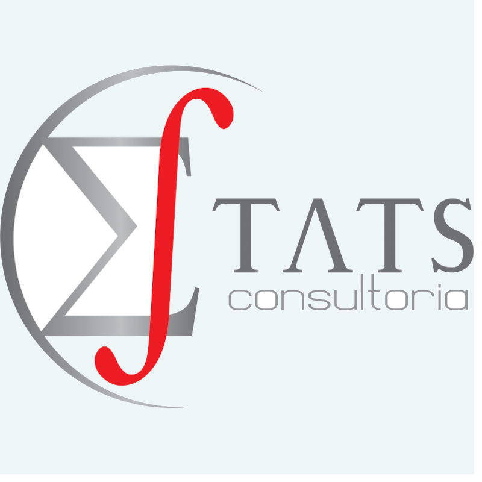

---
output:
  html_document:
    toc: true
    toc_float: true
---

# Configuração

```{r setup}
library(knitr)
opts_chunk$set(echo = FALSE,
               out.width = "10%", 
               fig.align = "center")
```

# Sintaxe de Markdown


{width=10%}

# Bloco de código

## Tamanho da imagem

```{r, out.width="30%", fig.cap = "Logo da Estats"}

```

```{r, out.width="300px", fig.cap = "Logo da Estats"}

```

## Alinhamento

```{r, out.width="30%", fig.cap = "Logo da Estats", fig.align = "left"}

```

```{r, out.width="300px", fig.cap = "Logo da Estats", fig.align = "right"}

```

```{r}
knitr::include_graphics(rep("img/1.png", 3))
```